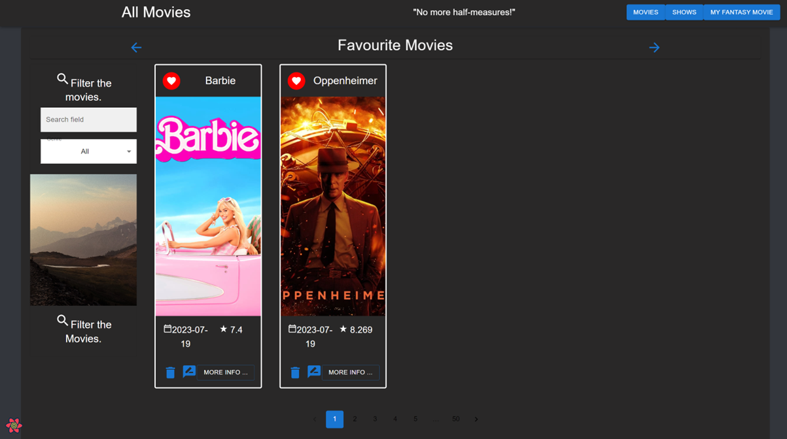
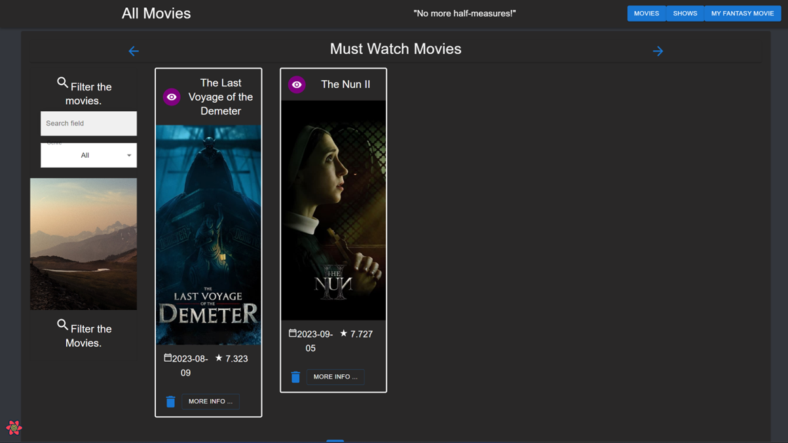
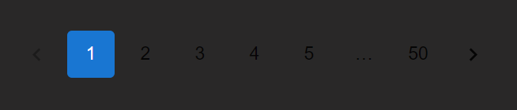

# React Movies App


## Features


### Liking Movies

One of the key features of this app is the ability to like your favorite movies. You can easily mark movies as your favorites, and they will be saved for easy access in your "Favorite Movies" list.



### Watch Later

Another handy feature is the "Watch Later" functionality. If you come across a movie you want to watch but don't have time for right now, you can add it to your "Watch Later" list.



### Pagination

To make it easier to explore a large collection of movies, the app includes a pagination system. You can navigate through multiple pages of movie listings.



## Getting Started

To run this application locally, follow these steps:

1. Clone the repository to your local machine:
2. Add the correct .env details
3. npm install any necessary dependancies
4. npm start
   ```shell
   git clone https://github.com/Adam0Brien/React-Movies-App.git
   echo -e "REACT_APP_TMDB_KEY=<api-key>\nFAST_REFRESH=false" > .env
   npm install
   npm start
   ```


